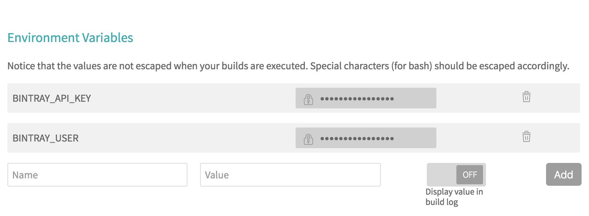

A seasoned developer now and then creates a piece of code that he or she would like to _reuse_ in a different project. When such time comes it is useful to know how to publish a library so that it can easily be incorporated into a different project. In this post I will describe how to publish a Kotlin library to [JCenter](https://bintray.com/bintray/jcenter) with `maven-publish` and `com.jfrog.bintray` Gradle plugins.


## Gradle Maven plugins

The first step is to apply [Maven plugin](https://docs.gradle.org/current/userguide/maven_plugin.html). The plugin adds support for deploying artifacts to Maven repositories. Note that in case of multi-project build e.g. [ShouldKO](https://github.com/bright/shouldko) the Maven plugin should be applied to every project that defines some artifact to be published. You can use `allprojects` to get rid of duplication e.g.:

```groovy
allprojects {
    repositories {
        jcenter()
    }

    apply plugin: 'kotlin'
    apply plugin: 'maven'

    group "pl.miensol.shouldko"
}
```

For the [`com.jfrog.bintray`](https://github.com/bintray/gradle-bintray-plugin) plugin, used later on, to work nicely with Maven artifacts we need to apply additional Gradle plugin. This additional piece is the [`maven-publish`](https://docs.gradle.org/current/userguide/publishing_maven.html) plugin which provides ability to publish artifacts in Maven format. All we need to do is to `apply plugin: 'maven-publish'` in the main project.

## Define Maven publishing

The [`com.jfrog.bintray`](https://github.com/bintray/gradle-bintray-plugin#step-7-define-artifacts-to-be-uploaded-to-bintray) plugin relies on properly defined [Maven Publications](https://docs.gradle.org/current/userguide/publishing_maven.html). The Gradle DSL allows us to define them easily basing on project properties e.g.

```groovy
publishing {
    publications {
        hamcrest(MavenPublication) {
            def project = project(':hamcrest')
            from project.components.java
            artifact project.sourcesJar { // not required, includes sourcesJar with correct classifer
                classifier "sources"
            }
            groupId group
            artifactId project.name
            version project.version
        }

        core(MavenPublication) {
            def project = project(':core')
            from project.components.java
            artifact project.sourcesJar {
                classifier "sources"
            }
            groupId group
            artifactId project.name
            version project.version
        }
    }
}
```

The above Maven Publications include sources artifact. Publishing additional classifiers for artifacts is important since [it allows for IDE to show a documentation popup or debug through the library source code](https://stackoverflow.com/a/20909695/155213).  However, one needs to define it first as it is not included by default when applying `java` or `kotlin` plugins to a Gradle project. This is easily done as follows:

```groovy
allprojects {
    task sourcesJar(type: Jar, dependsOn: classes) {
        from sourceSets.main.allSource
    }
}
```

## Project versioning

As you saw above, we have used `project.version` to indicate a version to `MavenPublication`. There are multiple strategies to version software but the [Semantic Versioning](https://semver.org/) scheme is widely accepted as a standard when it comes to libraries. If you wish to use it then there are plugins available for Gradle to simplify the mundane tasks of maintaining pre-release and patch versions. I like the set of plugin from [`ajoberstar`](https://github.com/ajoberstar/gradle-git/wiki) that provide an opinionated way to version your project based on git tags. Applying them is easy:


```groovy
plugins {
    id "org.ajoberstar.grgit" version "1.7.2"
    id "org.ajoberstar.release-opinion" version "1.7.2"
}
```

Now when you issue e.g. `gradle build` the plugin will [infer a next version based on your git repository state](https://github.com/ajoberstar/gradle-git/wiki/Release%20Plugins#how-do-i-use-the-opinion-plugin):

```
> Configure project : 
Inferred project: shouldko, version: 0.1.5-dev.0.uncommitted+4f71d34
```

## Bintray upload

Finally, when we are ready to upload our library and make it available for everyone we need to set up a [Bintray account](https://bintray.com/signup/oss). Once we have it, on the [profile](https://bintray.com/profile/edit) page we can access API key required to configure [the Bintray](https://github.com/bintray/gradle-bintray-plugin) Gradle plugin.

```groovy
bintray {
    user = project.hasProperty('bintrayUser') ? project.property('bintrayUser') : System.getenv('BINTRAY_USER')
    key = project.hasProperty('bintrayApiKey') ? project.property('bintrayApiKey') : System.getenv('BINTRAY_API_KEY')
    publications = ['core', 'hamcrest']
    pkg {
        repo = 'maven'
        name = 'shouldko'
        desc = 'Adds source line to tests assertion messages'
        userOrg = 'brightinventions'
        licenses = ['MIT']
        vcsUrl = 'https://github.com/bright/shouldko.git'
        labels = ['tests', 'hamcrest', 'junit']
    }
}
```

**The Bintray API key should be kept private and by no means included in the source code repository.**
We can configure `user` and `key` by looking at project properties and if not available using environment variables. This way there is no need to expose them publicly. 

```bash
gradle build bintrayUpload -PbintrayUser=<apiUser> -PbintrayApiKey=<apikKey>
```

The `repo` is the name of the Bintray repository. You can use the same Bintray repository to host multiple projects.

The Bintray plugin is very taciturn thus I like to add some log message to see when the `bintrayUpload` completes:

```groovy
afterEvaluate {
    tasks.bintrayUpload.doLast {
        logger.lifecycle("Uploaded artifacts to bintray at version $version")
    }
}
```

## Travis build

Every project should have at least some form of [continuous integration](https://en.wikipedia.org/wiki/Continuous_integration). For open source software there are at least couple of free build servers available. [Travis](https://travis-ci.org) is probably the most popular one. For gradle project Travis will by default call `build`. If you would like to upload the build artifacts to Bintray whenever successful build completes you need to add a line to `script` section of the `.travis.yml` like so:

```yaml
script:
  - ./gradlew build
  - ./gradlew bintrayUpload
```

Obviously the Bintray credentials need to be configured as well which can be done through a project configuration page:



Now, the Gradle git plugin will create a development version and publish it to Bintray on every Travis build.

## Tag to release

Whenever you want to release a new version of the library you now can simply tag a particular version e.g.

```bash
git tag 0.1.4
git push origin 0.1.4
```

After a local or continuos integration build completes you should see a new version in the Bintray web application. From there you need [to publish the version](https://bintray.com/docs/usermanual/starting/starting_tutorial2uploading.html).

## Use the new library

Once a version is published, you can consume it from a maven or gradle project easily. Until you [link your package to JCenter](https://bintray.com/bintray/jcenter), you need to inform your build system about a new maven repository location e.g.:

```groovy
repositories {
    jcenter()
    maven { url 'https://dl.bintray.com/brightinventions/maven' }
}
```

Note that `brightinventions` is the organization user name and `maven` is the repository name mentioned above. You are now, finally able to consume your library 🎉:

```groovy
compile 'pl.miensol.shouldko:hamcrest:0.1.4'
```

Enjoy!
