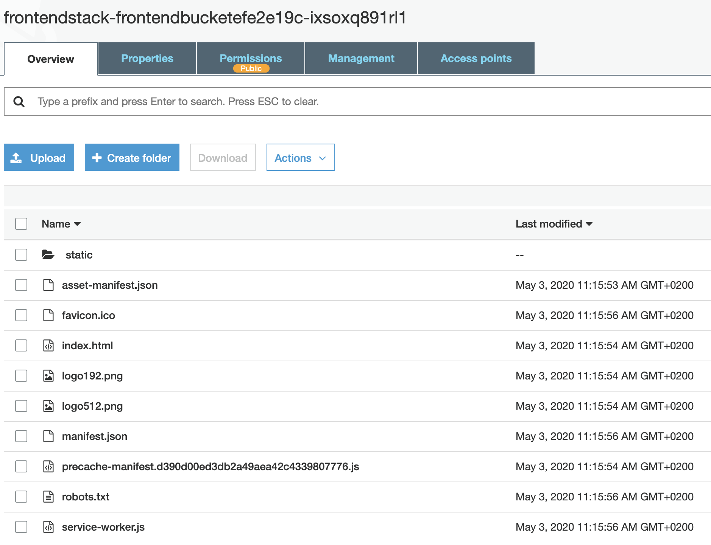

In this post we'll see how to create and deploy a static website using IaC using the following technologies:

- aws-cdk
- AWS CloudFormation
- AWS Lambda
- AWS S3

## Have a static website

For the sake of simplicity we'll use [Create React App][cra] in a directory called `my-project`:

```shell script
cd my-project
npx create-react-app frontend --template typescript
```

Create the static website content inside `frontend/build` directory with:

```shell script
cd frontend && yarn build
```

## Add aws-cdk to the project

Create infrastructure project with [aws-cdk][aws-cdk]:

```shell script
mkdir infrastructure && cd infrastructure
npx cdk init --language typescript
```

Note that in order to deploy you need to have AWS API credentials configured.
I prefer using AWS profiles, which you can set up using AWS CLI:

```shell script
aws configure --profile my-profile-name
```

The command will ask you couple of questions.
Please find the AWS Access Key Id and AWS Secret Access Key for your AWS account in [AWS Web Console IAM section][aws-iam].
The AWS CLI stores configuration under `~/.aws` (Linux or Mac) or `%USERPROFILE%\.aws` (Windows).

Please follow aws-cdk [Getting Started][aws-cdk-getting-started] to get more details.

## Deploy static content deployment to S3 website

We will deploy static content to AWS using `@aws-cdk/aws-s3-deployment` package. We need to add it to our project:

```shell script
cd infrastructure
npm i --save @aws-cdk/aws-s3-deployment
```

Next, let's tell aws-cdk to deploy contents of `frontend/build` directory to AWS.
In our template we have `InfrastructureStack` available under `lib/infrastructure-stack.ts`. 
Since it makes sense to have more focused CloudFormation stacks let's rename it to `FrontendStackStack`. 

```typescript
import * as cdk from '@aws-cdk/core';
import * as s3 from '@aws-cdk/aws-s3'
import * as s3deploy from '@aws-cdk/aws-s3-deployment'
import * as cloudfront from '@aws-cdk/aws-cloudfront'
import * as path from 'path'

export class FrontendStack extends cdk.Stack {
  constructor(scope: cdk.Construct) {
    super(scope, 'FrontendStack');
  }
}
```

All files, which our static content consists of, will be stored on S3, so we need to create a bucket there:

```typescript
super(scope, 'FrontendStack');

const frontBucket = new s3.Bucket(this, 'FrontendBucket', {
  websiteIndexDocument: 'index.html',
  publicReadAccess: true
});
```

Next, we need to tell `@aws-cdk/aws-s3-deployment` to push contents of `frontent/build` to the bucket created above:

```typescript
new s3deploy.BucketDeployment(this, 'DeployWebsite', {
  sources: [s3deploy.Source.asset(
    path.join(__dirname, '..', '..', 'frontend', 'build')
  )],
  destinationBucket: frontBucket
});
```

Since our aws-cdk stack uses assets we need to bootstrap our AWS account before **first** deployment:

```shell script
cd infrastructure
AWS_PROFILE=my-profile-name npx cdk bootstrap
```

Once the above command completes we can now finally deploy our website:

```shell script
cd infrastructure
AWS_PROFILE=my-profile-name npm run cdk deploy 
```

The command will prompt for confirmation before it creates the necessary security rules. 
You will see what resources get created or modified while the command runs. 
Afterwards all resources created are part of AWS CloudFormation `FrontendStack` stack.
Most importantly the command copied all files to S3 Bucket, which in turn can host the website.



One you find the S3 bucket created in the AWS CloudFormation stack:


Your website is now available under a URL similar to:

`http://frontendstack-frontendbucketefe2e19c-ixsoxq891rl1.s3-website.eu-central-1.amazonaws.com/`

## Improve performance of static website with CloudFront

The website loads files directly from S3 bucket. The S3 bucket, by default, lives inside a single AWS Region, 
which means that visitors from far away may suffer from subpar loading speeds. 

For production setup we can use AWS CloudFront CDN, which distributes our content across over 100 locations around the globe. 
Using this solution with `@aws-cdk/aws-s3-deployment` is a piece of cake:

```typescript
const distribution = new cloudfront.CloudFrontWebDistribution(this, 'Distribution', {
  originConfigs: [{
    s3OriginSource: {
      s3BucketSource: frontBucket
    },
    behaviors : [ {isDefaultBehavior: true}]
  }]
});

new cdk.CfnOutput(this, 'DistributionDomainName', {
  value: distribution.domainName
})

new s3deploy.BucketDeployment(this, 'DeployWebsite', {
  sources: [s3deploy.Source.asset(
      path.join(__dirname, '..', '..', 'frontend', 'build')
  )],
  destinationBucket: frontBucket,
  distribution: distribution,
});
```

After you update the stack with `AWS_PROFILE=my-profile-name npm run cdk deploy` you will find a new CloudFront distribution created.
Note that it make take few minutes to complete. 
We added `CfnOutput` to make it easier to find the CloudFront distribution autogenerated domain name.

```log
Outputs:
FrontendStack.DistributionDomainName = d3a9wcc4fxw2d.cloudfront.net
```

Now the static website uses global content delivery network! 

You can find full example used in this post [in the Github repository][repository]

[cra]: https://create-react-app.dev/docs/adding-typescript/
[repository]: https://github.com/miensol/miensol.github.io/tree/develop/content/posts/fast-static-website-with-aws-cdk
[aws-iam]: https://console.aws.amazon.com/iam/home?region=eu-central-1
[aws-cdk]: https://docs.aws.amazon.com/cdk/latest/guide/home.html
[aws-cdk-getting-started]: https://docs.aws.amazon.com/cdk/latest/guide/getting_started.html
